# 数据结构

[TOC]

###  0.1 数据结构入门

- 数据结构是一门研究非数值计算的程序设计中计算机的**操作对象**以及他们之间的**关系**和**操作**的学科
- 操作对象：**表，数，图**

### 1.1基本概念和术语1

#### 1.1.1 数据，数据元素，数据项和数据对象

- **数据**（Data）
  - 能被输入计算机且能被计算机处理的**各种符号的集合**
  - 信息的载体
  - 对客观事物符号化的表示
  - 能被计算机识别储存和加工
- **数据元素**（Data element）
  - 数据的**基本单位**
  - 也简称为：元素，记录，**结点**，顶点 
  - 也可由多个**数据项**组成
- **数据项**
  - 构成数据元素不可分割的**最小单位**
- **数据项 ** 含于  **数据元素**  含于  **数据**
- **数据对象**（Data Object）
  - 是**性质相同的数据元素的集合** ，是数据的一个**子集**
  - 例如：整数的数据对象是：N{0 ， +-1 ， +-2...}
  - **数据对象与数据的关系：集合的子集。而数据元素是集合的个体**

#### 1.1.2 数据结构

- 数据结构
  - 数据元素不是鼓励的，他们之间存在某种关系，**数据元素之间的关系成为结构**
  - 是指相互之间存在特定关系的数据元素集合
  - 数据结构是**带结构的**数据元素的集合
  - 包括：
    - 数据元素之间的逻辑关系，（**逻辑结构**）
    - 数据元素及其关系在计算机内存中的表示（**映像**）
    - 数据的**运算和实现**， 即对数据元素可以世家操作以及操作在相应的存储结构上的实现
  
- 逻辑结构

  1. 种类

     - 线性结构：

       有且仅有一个开始和终端节点，并且每个节点都是**一对一**
       如：线性表，栈，队列，串

     - 非线性结构：
       一个节点对应多个，**一对多或者多对多**
       如：树和图

- 存储结构
  
     1. **顺序存储结构**：
        - 一组**连续**的存储单元依次存储数据结构元素，数据元素之间的逻辑关系由元素的**存储位置**来表示
        - 如：c语言中，用数组来实现顺序存储结构（内存上一段连续的地址）
     2. **链式存储结构**：
        - 用一组**任意**的存储单元存储数据元素，他们间的逻辑关系用**指针**来表示
        - 如：c语言中，用**指针**来实现
     3. **索引存储结构**
        - 在存储节点信息的同时，建立附加的**索引表**
        - 索引表中的每一项被称为索引项
     4. **散列存储**
        - 

#### 1.1.3抽象数据类型

- （Abstract Data Type ADT）☞：**一个数学模型以及定义在此数学模型上的一组操作**

  **抽象数据类型的形式定义**
  抽象数据类型可用（D，S，P）三元组定义
  定义格式：
  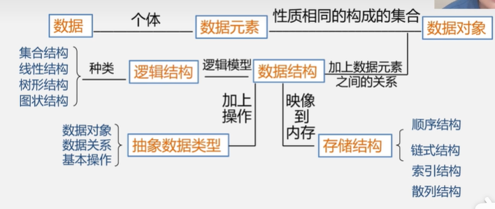

  ```c
  ADT 抽象数据类型名{
   数据对象
   数据关系
   数据操作
  }ADT 抽象数据类型
  ```

  c语言代码：

  ```c
  typedef struct{
      float real;
      float imagpart
  }Complex;
  ```

  注：

  ```c
  // 原始写法（每次使用时都要写 struct）
  struct Point {
      int x;
      int y;
  };
  struct Point p1;
  
  // 使用 typedef 简化
  typedef struct {
      int x;
      int y;
  } Point;        // 定义结构体别名 Point
  Point p2;       // 直接使用别名，无需写 struct
  ```


#### 1.1.4 算法和算法分析

1. **算法是高效的**
2. 衡量算法的效率：
   - 时间效率：耗费的**时间**
   - 空间效率：耗费的存储**空间**
   - **一般时间空间效率是矛盾的**
3. 时间效率的度量
   - 事后统计：实际运行测试时间
   - 事前分析：直接估算：大致执行一种简单操作的时间与算法中进行的简单操作**次数的乘积**
   - 一般**看执行次数最多的语句**就是**O（n的执行次数次方）**
   - 时间复杂度T(n)递增的顺序：
     **常对幂指**
4. 空间效率：
   - 算法**自身占据的空间**和**辅助空间**

#### 1.1.5 c语言补充

- **`typedef`**：是一个关键字，用于为已有的数据类型定义一个新的别名（**类型重命名**）。

  ```c
  typedef int Integer;  // 将 int 重命名为 Integer
  Integer num = 10;     // 等价于 int num = 10;
  
  struct Point {
      int x;
      int y;
  };
  struct Point p1;  // 必须带 struct 关键字
  
  
  typedef struct {
      int x;
      int y;
  } Point;          // 直接定义别名 Point
  Point p1;         // 无需写 struct
  
  // 定义一个函数指针类型，指向返回 void、参数为 int 的函数
  typedef void (*Callback)(int);
  
  void print_number(int num) {
      printf("%d\n", num);
  }
  
  Callback cb = print_number;  // 直接使用 Callback 类型
  cb(42);                      // 调用函数指针
  ```

  

### 1.2 栈和队列

#### 1.2.1 定义和特点

- 栈和队列是插入和删除都只能在表的**端点** 进行的 **线性表**
  栈：操作都是表尾
  队列：插入是尾，删除是头
- **栈-------后进先出**
  
- **队列-----先进先出**
  ****

#### 1.2.2 栈的定义和特点

- **栈** 是仅在表尾插入，删除的线性表；**LIFO**

- **表尾**称为**栈顶**（top）；表头称为**栈底**（base）

- 插入元素到栈顶的操作：**入栈**（push）
  删除栈顶的元素的操作：**出栈**（pop）

- 栈的抽象数据类型的类型定义：

  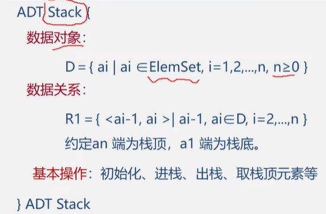

- 栈的表示和实现
  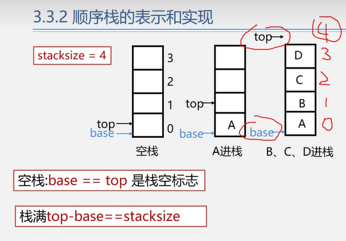

##### 1.2.2.1 顺序栈的实现

```c
#include<stdio.h>
#include<stdbool.h>

#define MAX_SIZE 100 // 定义最大容量

// 定义栈的结构体
typedef struct Stack {
    int data[MAX_SIZE]; // 顺序栈是由数组实现
    int top; // 栈顶指针
    int base; // 栈底指针
} Stack;

// 初始化栈
void InitialStack(Stack *S){
    S->top = 0;
    S->base = 0;
}

// 鍒ゆ柇鏍堟槸鍚︿负绌烘垨宸叉弧
bool IsEmpty(Stack *S){
    if(S->top == S->base){
        printf("栈空\n");
        return true;
    }
    return false;
}
bool IsFull(Stack *S){
    if(S->top == MAX_SIZE){
        printf("栈满\n");
        return true;
    }
    return false;
}

// 入栈
void Push(Stack *S , int e){
    if(!IsFull(S)){
        S->data[S->top] = e;
        S->top++;
        printf("入栈成功\n");
    }else{
        printf("入栈失败，栈满\n");
    }
}

// 出栈
void Pop(Stack *S , int* e){
    if(!IsEmpty(S)){
        S->top--;
        *e = S->data[S->top];
        printf("出栈成功 ");
    }else{
        printf("栈空，出栈失败\n");
    }
}

// 获取栈顶元素
int GetTop(Stack *S){
    if(!IsEmpty(S)){
        return S->data[S->top-1];
    }else{
        printf("栈空\n");
        return -1;
    }
}

int main(){
    Stack S;
    InitialStack(&S); 
    int e = 0;
    for(int i = 0; i < 10; i++){
        Push(&S , i); 
    }
    printf("栈顶元素为 %d\n", GetTop(&S));
    for(int i = 0; i < 10; i++){
        Pop(&S , &e);
        printf("%d\n", e);
    }
    
    return 0;
}
```


#### 1.2.3队列的定义和特点

- **队列** 仅能在表尾插入，在表头删除**FIFO**

- 表尾称为**队尾**（top）；表头称为**队首**（base）

- 插入元素到队尾的操作：**入队**（push）
  删除队首的元素的操作：**出队**（pop）
  
  

### 1.3 串，数组和广义表

#### 1.3.1 串 （String）

- 由任意字符组成的有限序列

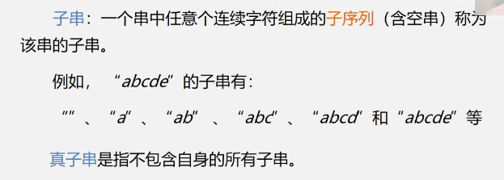

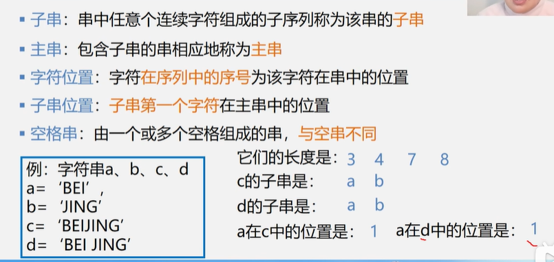


##### 1.3.1.1 字符串匹配

- 算法目的：**确定主串中所含字串第一次出现的位置**

- BF（暴力）

  ```c
  #include <stdio.h>
  #include <string.h>
  
  int main()
  {
      char A[10] = "mmdhellof";
      char B[6] = "hello";
      int Alenth = strlen(A);
      int Blenth = strlen(B);
      for (int i = 0; i <= Alenth - Blenth; i++) {
          int j;
          for (j = 0; j < Blenth; j++) {
              if (A[i + j] != B[j]) {
                  break;
              }
          }
          if (j == Blenth) {
              printf("find it in %d\n", i+1);
              return 0;
          }
      }
      printf("not found\n");
      return 0;
  }
  ```

  

- KMP

  - 在 KMP 算法中，需要计算模式串中每个位置之前的子串的最长公共前后缀长度。所谓最长公共前后缀，是指一个字符串的前缀和后缀中相同且长度最长的部分。例如，对于字符串 `"abcab"`，其前缀有 `"a"`、`"ab"`、`"abc"`、`"abca"`，后缀有 `"b"`、`"ab"`、`"cab"`、`"bcab"`，最长公共前后缀是 `"ab"`，长度为 2。
  
  -  匹配过程
    1. **初始化**：文本串 `T` 和模式串 `P`，以及一个用于记录模式串最长公共前后缀长度的数组 `next`。
    2. **计算 `next` 数组**：`next` 数组记录了模式串中每个位置之前的子串的最长公共前后缀长度。通过计算 `next` 数组，可以在匹配过程中避免不必要的回溯。
       -  next 数组计算规则：
         计算当前最长公共子串，如果长度为N，那么就是匹配串第N号位与当前主串进行比较
    3. **匹配操作**：从文本串和模式串的起始位置开始比较，如果字符相等，则继续比较下一个字符；如果字符不相等，则根据 `next` 数组将模式串向右移动一定的位数，继续进行比较，直到找到匹配的子串或者遍历完整个文本串。
    
  -  ```c
    #include <stdio.h>
    #include <string.h>
    // j是当前匹配串的移动位置，next[j]是当前匹配串的最长公共前后缀长度
    void computeNext(char* pattern, int* next) {
        int len = strlen(pattern);
        int j = 0;
        next[0] = 0;
    
        for (int i = 1; i < len; i++) {
            if (j>0 &&  pattern[i] != pattern[j]) {
                j = next[j - 1];
            }
            if (pattern[i] == pattern[j]) {
                j++;
            }
            next[i] = j;
        }
    }
    
    // KMP 搜索函数
    int kmpSearch(char* text, char* pattern) {
        int textLen = strlen(text);
        int patternLen = strlen(pattern);
        int next[patternLen];
    
        // 计算 next 数组
        computeNext(pattern, next);
    
        int j = 0;
        for (int i = 0; i < textLen; i++) {
            if (j > 0 && text[i] != pattern[j]) {
                j = next[j - 1];
            }
            if (text[i] == pattern[j]) {
                j++;
            }
            if (j == patternLen) {
                return i - patternLen + 1; // 找到匹配，返回匹配的起始位置
            }
        }
        return -1; // 未找到匹配
    }
    
    
    int main() {
        char text[] = "ABABDABACDABABCABAB";
        char pattern[] = "CABAB";
    
       
        if (kmpSearch(text, pattern)) {
            printf("Pattern found at index %d\n", kmpSearch(text, pattern));
        } else {
            printf("Pattern not found\n");
        }
    
        return 0;
    }    
    ```
  

#### 1.3.2数组

#####  1.3.2.1顺序存储结构

- 在内存中是连续排布的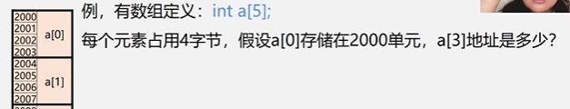

 		a【3】 地址就是2012开始到2015截止

- 

##### 1.3.2.2 特殊矩阵压缩存储

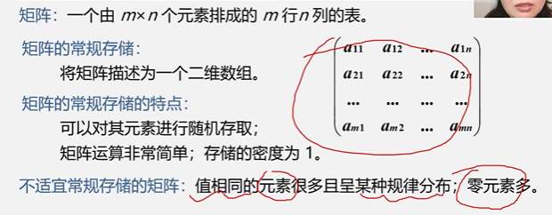

- **矩阵压缩存储：**为多个相同的非0元素只分配一个存储空间，对0元素不分配存储空间


- 适用矩阵：**对称矩阵，对角矩阵，三角矩阵，稀疏矩阵**
  - 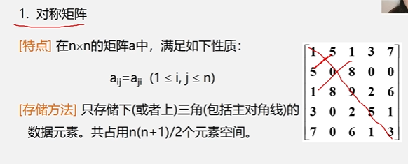
    
  - 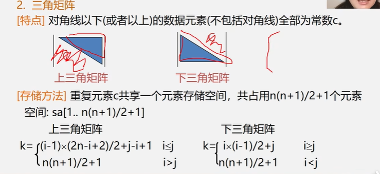
  
  - 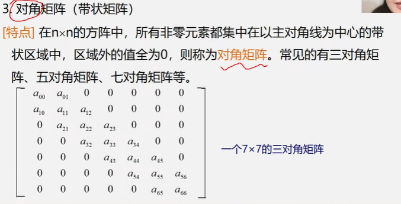
  
  - 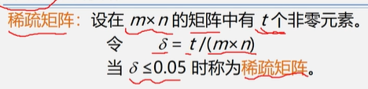
  
    ​													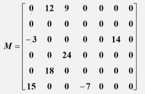
    ​																但是这样的矩阵也可用压缩
  
    - 三元组法：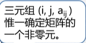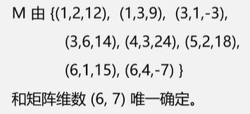

#### 1.3.3 广义表

##### 1.3.3.1 广义表定义和性质：

- **广义表**又称为列表，是 n ≥ 0个元素 a0， a1 ， an-1的有限序列，其中每一个ai 是一个 **原子** 或者也是 **广义表**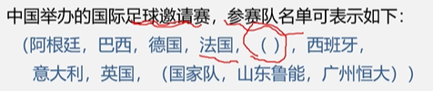
- 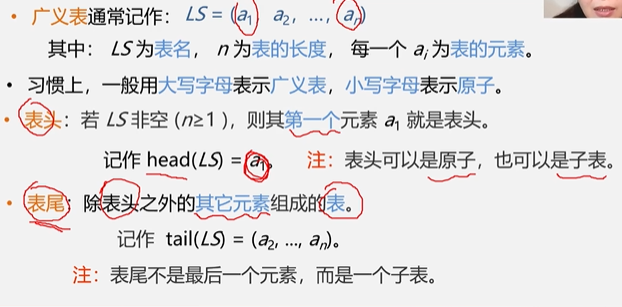
- 性质
  - 广义表长度定义为最外层包含的元素个数
  - 广义表升读定义为该广义表展开后**所含括号的重数**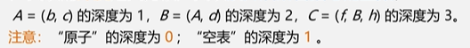
  - 广义表是**多层次**结构，其中的元素可以是氮元素，也可以是子表，子表也可以含有子表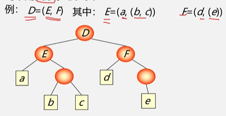
  - 广义表通常用链表存储


### 1.4 树和二叉树

#### 1.4.1 树的定义 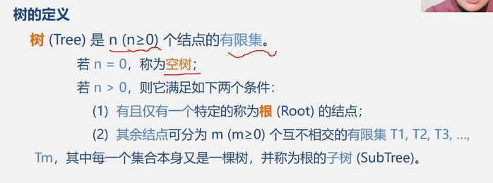

**树的度：树内各结点的度的最大值**
		  度 == 0的节点（又称（叶子）**终端结点**）

​		  度 ！= 0的结点叫做**分支结点**

​		  除了根节点外的所有结点都称为**内部节点**

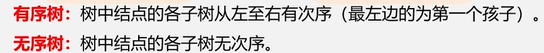

森林 ：是 m （m>=0）棵互不相交的树的集合 （把有同一根结点的树的根节点删除了）

#### 1.4.2 二叉树

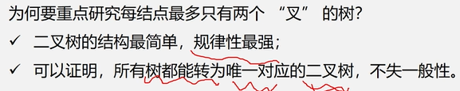

##### 1.4.2.1特点：

1. 由一个根节点，以及一个**左子树**和**右子树** 的二叉树构成
2. 每个结点最多两个孩子
3. 子树有左右之分，不可颠倒
4. 他可以是空集
5. 二叉树只有一个结点时，也要分左右（不同于一般树）
   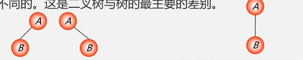

##### 1.4.2.2 性质：

1. 在二叉树的第 i 层，最多 **$2^{i-1}$** 个结点

2. 一个二叉树总共有 （深度为k的时候，最多有 **$2^{k-1}$**

3. 对任何一个二叉树，如果其子叶数位n0，度为2的结点数位n2，则$n0 = n2 + 1$

##### 1.4.2.3 满二叉树

**定义：** 一棵树中所有结点都是2个的二叉树称为**满二叉树**

**特点** ： 每一个结点都是满2的结点；

##### 1.4.2.4**完全二叉树**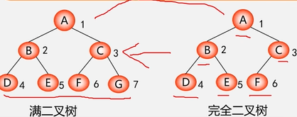

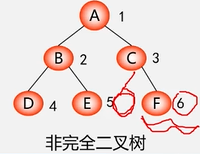

**性质：**

1. 具有n个结点的完全二叉树深度为
   【$\log_{2} n $】 + 1 

2. 如果一颗有n个结点的完全二叉树，结点按层序编号，对**任意结点 i** 有：
    （1）如果 **i = 1** 则结点 i 是二叉树的根；如果 i > 1 则双亲是结点  【i/2】

    （2）如果 **2i > n** ，则结点 i 为**叶子**结点无左孩子；否则其左孩子是**2i**

​		（3）如果 **2i+1 > n** ，则结点i无右孩子；否则其右孩子是**2i + 1**

##### 1.4.2.5 二叉树的存储结构

1. **顺序存储**

   无论啥二叉树，将其以满二叉树的形式编号，然后再看结点有数据的储存，无数据的存为0或其他，要异与有数据结点
   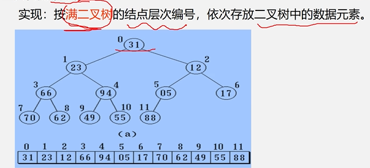
   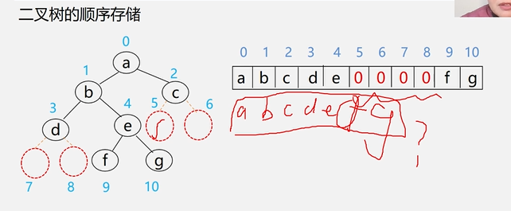

   缺点：对于稀疏树（如单支树），其耗费的空间很大

2. **链式存储**
   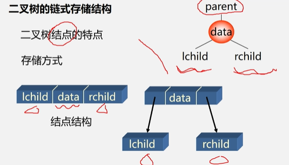

   ```c
   typedef struct BiNode{
   	any data;
       struct BiNode *lchild,*rchild
   }BiNode,*BiTree;
   ```

   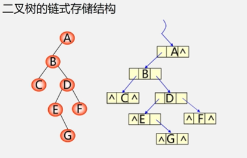

在 **n** 个结点的二叉链表中 ， 有 **n + 1 **个空指针域

三叉链表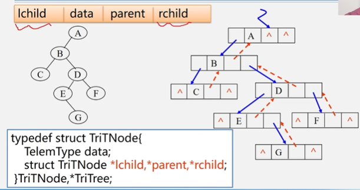

##### 1.4.2.6 遍历二叉树和线索二叉树

1. **遍历二叉树** ：顺着某条搜索路径，访问二叉树中的结点，使每个结点均被且仅被访问一次
2. 

- 先序遍历
